# Student final project: Fitness Android Application with Google Fit and Jetpack Compose

#### Project track user daily step progress with google fit api and application. Shows history track in weekly format, current and all time record. User can save workouts and hydration entries, easily filter list and edit them. With help of data store user profile data are saved localy.
#### Project is made with MVVM design pattern and Clean Architecture guidelines.

## Screens:
* [Home](#home)
* [Goals](#goals)
* [Journal](#journal)
* [Profile](#profile)

## Made with:
* Kotlin
* Compose
* Google Fit
* Room DB
* DataStore

## Home
Shows daily progress, current streak and all time record in successive days completing daily goal.

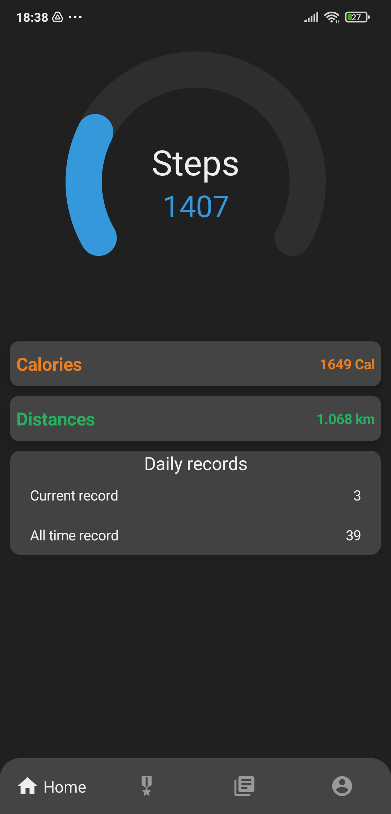

## Goals
You can change daily goal, see current streak and all time record, and daily history in weekly format, with indication if goal is completed for that day.

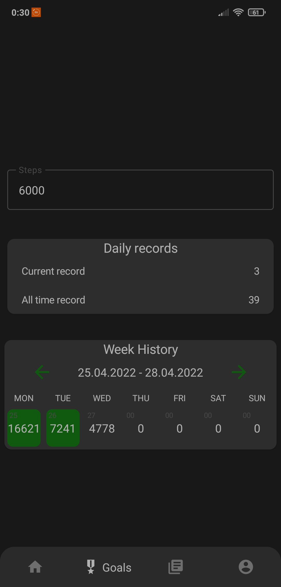

## Journal
Displayes two type of data, hydration and workout. There is filter in top part of screen, at bottom right corner is FAB to add new entrie with sub menu for you to pick hydration or workout entrie. 

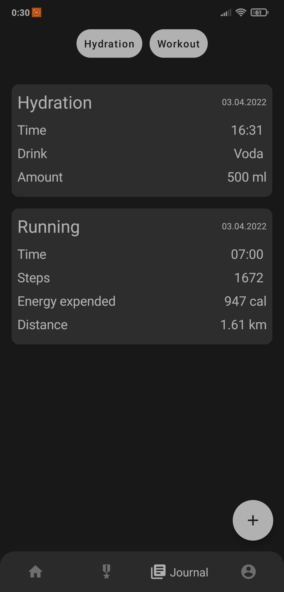 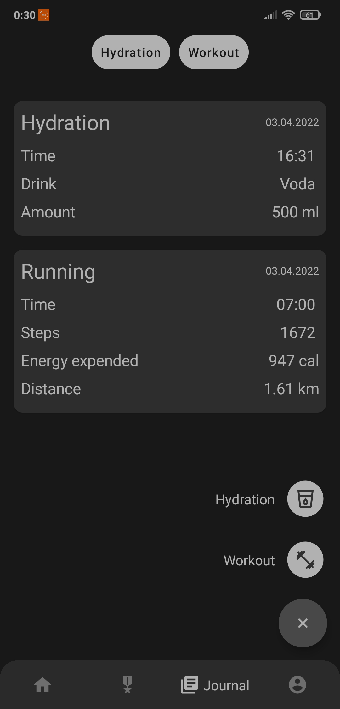 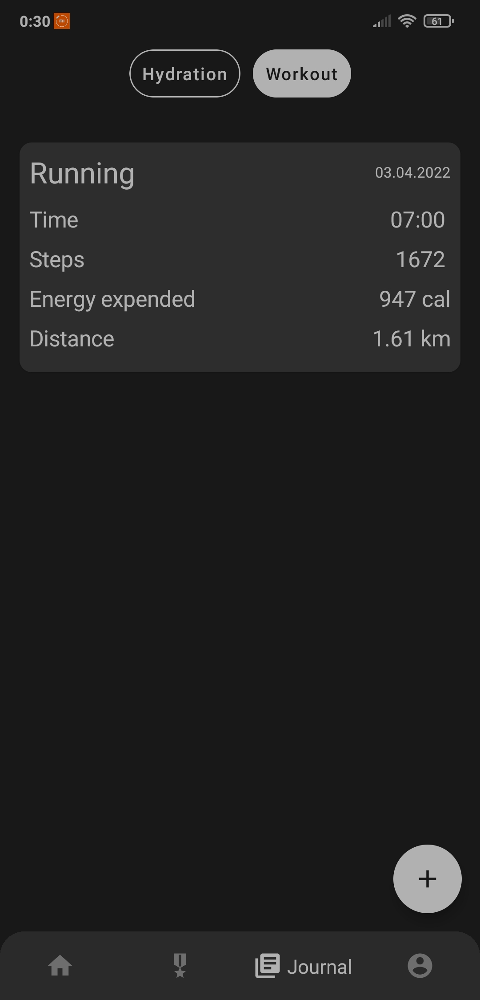 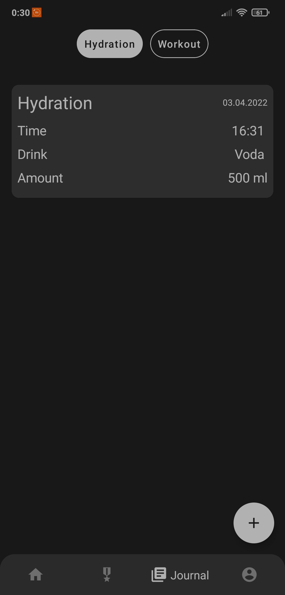 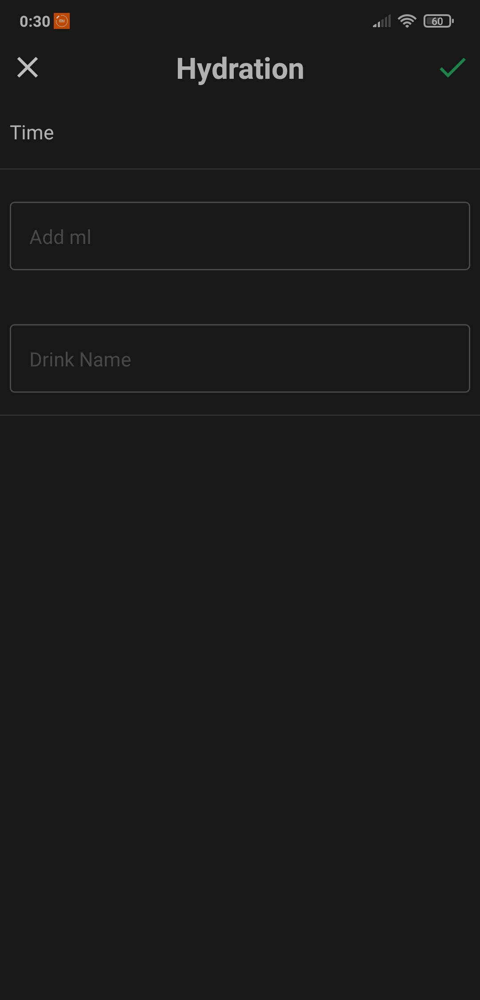 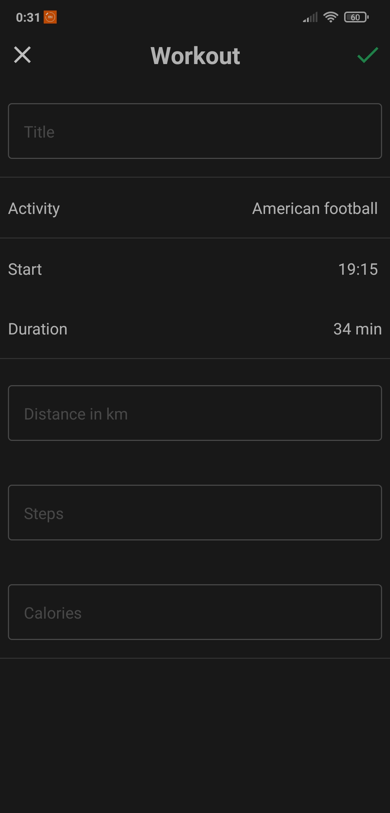 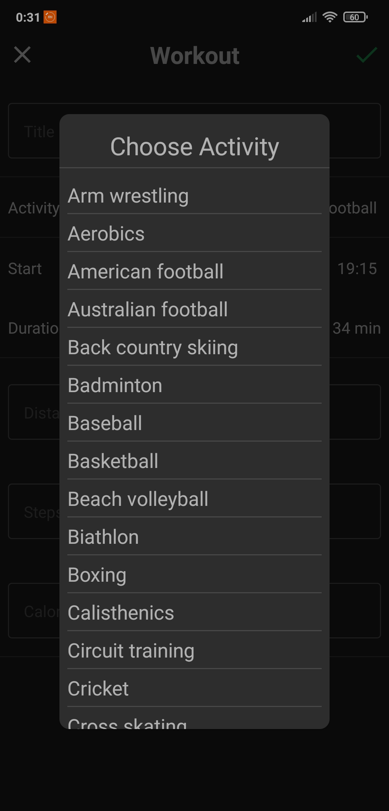 

## Profile

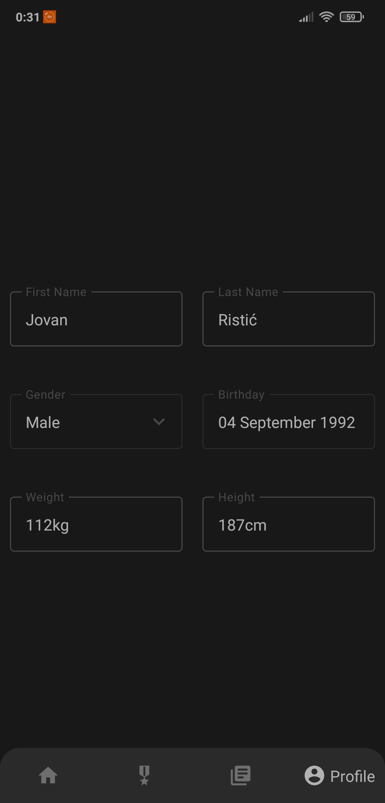  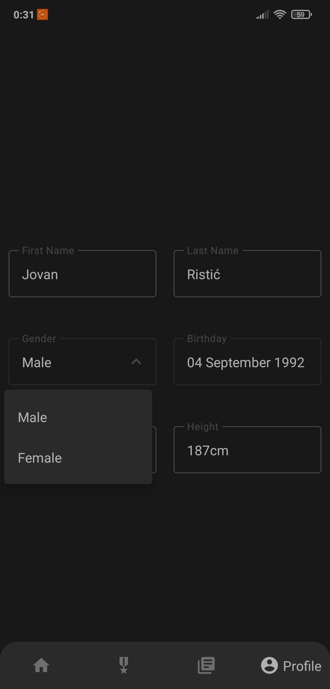 

